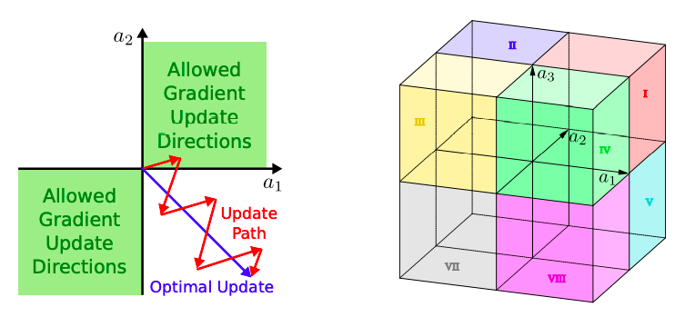
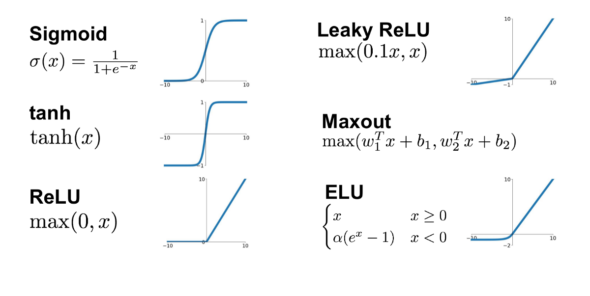
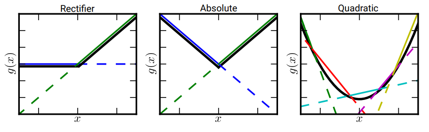
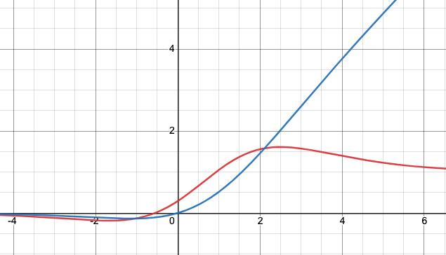
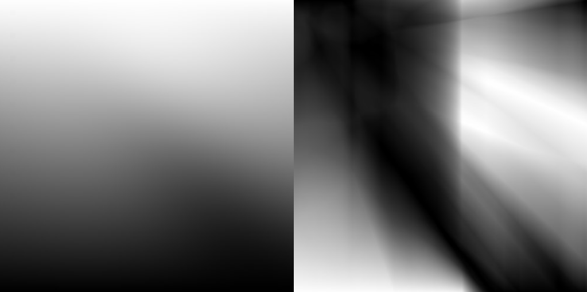
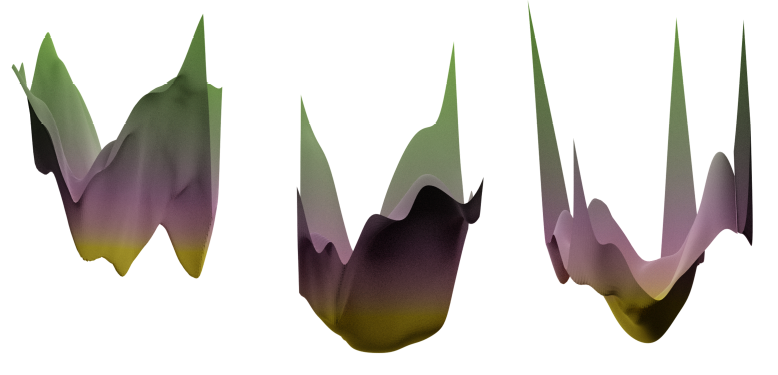
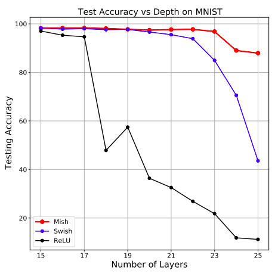

# Activation functions

 

* (5.1) **Nonlinear activation functions.** Previously we have discussed output nodes and loss functions. Now we turn our attention to the hidden layers 
    $$\bold h_i = g\left(\bold W_i\bold h_{i-1} + \bold b_i \right).$$

    The **activation function** $g$ is necessarily nonlinear. Otherwise, the network will only be able to model a linear map. Most functions $g$ that we use are unary functions applied element-wise. Moreover $g$ must be differentiable almost everywhere since we want to perform backpropagation. 

 

* (5.2) **Sigmoid activation.** The sigmoid function is defined as 
  $g(x) = \frac{1}{1 + e^{-x}}.$ This function
  has a range of $[0, 1]$ and is everywhere differentiable, hence a good function for converting scores to probabilities. Observe that (1) saturation kills gradients for large $|x|$ so that downstream gradients become zero since the local gradients vanish. How large? Not too large, $\frac{\partial g}{\partial x} \approx 4.5\times 10^{-5}$ for $|x| \geq 10.$ Moreover, (2) outputs are not zero-centered, that is $g(x) > 0$ for all $x \in \mathbb{R}.$ This introduces a positivity bias after the first layer. Finally, (3) gradient updates is restricted to certain directions that lead to  inefficient optimization:
    $$
        {\color{salmon}\frac{\partial \mathcal{L}}{\partial w_{i}}}
        ={\color{salmon}\frac{\partial \mathcal{L}}{\partial g}} {\color{skyblue} \frac{\partial g}{\partial w_{i}}}
        ={\color{salmon}\frac{\partial \mathcal{L}}{\partial g}} 
        {\color{skyblue}\frac{\partial g}{\partial x} \frac{\partial x}{\partial w_{i}}}={\color{salmon}\frac{\partial \mathcal{L}}{\partial g}} {\color{skyblue} \frac{\partial g}{\partial x} x_{i}}.
    $$
    Here we assume that $\bold x$ is an output of a hidden layer with a sigmoid activation. We assume its sigmoids all the way up so that $x_i > 0.$ Meanwhile we know that $\frac{\partial g}{\partial x} > 0$ since $\sigma$ is increasing. Therefore, 
    $$\operatorname{sgn}\left({\color{salmon}\frac{\partial \mathcal{L}}{ \partial w_{i}}}\right)=\operatorname{sgn}\left({\color{salmon}\frac{\partial \mathcal{L}}{\partial g}}\right).$$ 
    So all gradients in the hidden layers have the same sign (+ or -). The problem with this is that it restricts the space in which gradient updates can happen and leads to effectively very inefficient optimization (see figure). This problem becomes even bigger in higher-dimensional space, as the subset of possible directions to move into is even smaller relative to the full space: $2$ out of $2^d$ directions. This problem can be somewhat alleviated by using minibatches.

     

    

      
      

      

      <b>Figure.</b> Gradient update restricted to quadrants 1 and 3 (left). Problem becomes worse in higher dimensions (right).
    

 

* (5.3) **Tanh activation.** Solves most of the problems of the sigmoid function. Tanh is basically the sigmoid, except rescaled and recentered:
  $$g(x) = \dfrac{2}{1 + \exp(-2x)} - 1.$$

  The tanh activation maps any input to the range $[-1, 1].$ Restriction to positive and negative directions are solved by allowing negative outputs. Problem again with saturation killing gradients remain unsolved.

   

  

  
  

* (5.4) **ReLU activation.** A breakthrough improvement over the sigmoid-type activations is the **rectified linear unit** or **ReLU** proposed in [[Nair, Hinton (2010)]](https://icml.cc/Conferences/2010/papers/432.pdf). ReLU is defined as 
  $$\text{ReLU}(x) = \max(0, x).$$ 
  This functional form fixes the saturating gradients problem for the sigmoid by (1) being unbounded above, and (2) having fixed derivatives of either $1$ for positive values or zero for negative values. 
    
  ReLU typically leads to **much faster convergence** than the sigmoid or tanh activations since gradient steps have the same magnitude as the learning rate, and the function and its derivative involves trivial amount of computation. ReLU is not differentiable at $x = 0,$ but that does not matter for training as we are not going to query the function exactly at $0$. 
    
  One issue with ReLUs is that once the upstream values become negative, the gradient becomes zero. ReLU nodes become **dead**, i.e. they don't participate in learning since all downstream gradients are zero. It would be difficult push weights on lower layers so that the ReLU node receives positive upstream values. We can initialize with a positive bias $b > 0$ to avoid this. 
    
 

* (5.5) **LReLU** [[Maas (2013)]](https://ai.stanford.edu/~amaas/papers/relu_hybrid_icml2013_final.pdf) or **Leaky ReLU**  is defined as
  $$\text{LReLU}(x)
  = \begin{cases}
      x & \text { if } x>0 \\ 
      0.01 x & \text { if } x \leq 0.
    \end{cases}	
  $$
  This fixes the problem of having dead ReLUs, since its derivatives for negative values is nonzero, i.e. $0.01$, and is closer to having zero-centered outputs. In general, using ReLU leads to faster convergence and is computationally efficient. A generalization of this is the **Parametric ReLU** or **PReLU** [[He, et. al. (2015)]](https://www.cv-foundation.org/openaccess/content_iccv_2015/papers/He_Delving_Deep_into_ICCV_2015_paper.pdf) which introduces a learnable parameter $\alpha > 0$
  $$\text{PReLU}(x)
  = \begin{cases}
      x & \text { if } x>0 \\ 
      \alpha x & \text { if } x \leq 0
    \end{cases}	
  $$
  PReLU shares the advantages of the LReLU but is more expressive since it allows the slope of the negative part of the activation to be adjusted according to which best learns the dataset.

 

* (5.6) **ELU** [[Clevert, et. al. (2016)]](https://arxiv.org/pdf/1511.07289v4.pdf) which stands for **exponential linear units** is defined as
  
  $$\text{ELU}(x)
  = \begin{cases}
      x & \text { if } x>0 \\ 
      \alpha(e^x-1) & \text { if } x \leq 0
    \end{cases}	
  $$

  The default for the parameter is $\alpha = 1$ where the function is everywhere differentiable, otherwise the slopes do not match at zero. For $\alpha = 0$, we recover the ReLU function. An ELU unit has a saturation for $x \ll 0$ which adds robustness to noise for some problems. Otherwise it shares the benefits with the LReLU. 

 

* (5.7) **Maxout** [[Goodfellow, et. al. (2013)]](https://arxiv.org/abs/1302.4389v4) is defined as 
  $$\text{Maxout}(\bold x) = \max(\bold w_1^\top\bold x + b_1, \bold w_2^\top \bold x + b_2)$$ 
  where the weights and biases are learnable. This increases the number of learnable parameters per neuron but also ensures that gradients flow to the lower layers since the saturating parts of the maxout unit is also a function of the parameters which are learnable (much like the PReLU).

     

    

    
    

      <b>Figure.</b> Maxout for 1-dimensional input. Approximating the ReLU, absolute ReLU, and the quadratic function.
    

     

    It turns out that the maxout activation can approximate any convex function with enough parameter nodes. The paper also shows that a network with the maxout node is a universal approximator which means that we don't lose any expressivity when using this activation.  Empirical evidence shows that maxout is highly compatible with dropout. 

    > "... maxout propagates variations in the gradient due to different choices of dropout masks to the lowest layers of a network, ensuring that every parameter in the model can enjoy the full benefit of dropout and more faithfully emulate bagging training."

 

* (5.8) **Mish** [[Misra (2020)]](https://arxiv.org/pdf/1908.08681.pdf) is defined as 
  $$\text{Mish}(x) = x \tanh(\text{softplus(x)})$$ 
  where $\text{softplus}(x) = \log(1 + \exp(x)).$ Mish outperforms every other activation (LReLU, ReLU, and Swish) for computer vision tasks: classification in ImageNet-1k and MNIST, and object detection in MS-COCO (see paper). Some desirable properties of Mish: 

  * Mish is self-regularizing: $\text{Mish}(x) \approx 0$ for $x \ll 0$; 

  * Non-monotonicity allows gradient updates for small negative values makes the unit less susceptible to dying resulting in a more dynamic backpropagation; and

  * Smooth output landscapes suggest smooth loss landscapes which help in easier optimization and better generalization.

   

  Note that ReLU and Swish also possess the first two properties. One possible reason that Mish outperforms these functions is that, in addition to having good dynamics of backpropagating gradients, the loss landscape of Mish has better geometry. For a ResNet-20 model trained on the CIFAR-10 dataset, Mish has a wider minima compared to ReLU and Swish with the former having multiple local minimas. Mish has the lowest loss out of the three.  

   

    

    
    

      <b>Figure.</b> Mish (blue) and its derivative (red). The derivative is zero for large absolute values but is non-negative in both directions for small values of its input. Moreover, the function does not saturate for large positive input and saturates to zero for large negative input. 
    

   

   

  

  
  

    <b>Figure.</b> Output landscape of Mish (left) and ReLU (right).
  

   

   

  

  
  

    <b>Figure.</b> Comparison between the loss landscapes of (from left to right): (a) ReLU, (b) Mish and (c) Swish activation function for a ResNet-20 trained for 200 epochs on CIFAR-10.

  

   

   

  

  
  

    <b>Figure.</b> Comparison between Mish, Swish, and ReLU activation functions in terms of test accuracy with increasing depth of the neural network on the MNIST dataset. This reflects better network dynamics when using Mish.

  

 

* (5.9) **Rule of thumb.** We only showed the most common ones, but there exist many more. In practice, no one-size-fits-all: the choice of activation function depends on problem &mdash; often found using trial-and-error. But the most important thing is to **ensure a good gradient flow** during optimization. We can follow the ff. rule of thumb:

  1. Use ReLU by default with small enough learning rate.
  2. Try Leaky ReLU, Maxout, or ELU for some small additional gain. Mish can be used to get SotA performance on computer vision tasks (e.g. YOLOv4). 
  3. Tanh should be preferred over sigmoid, and is often used in recurrent models.

 

---
